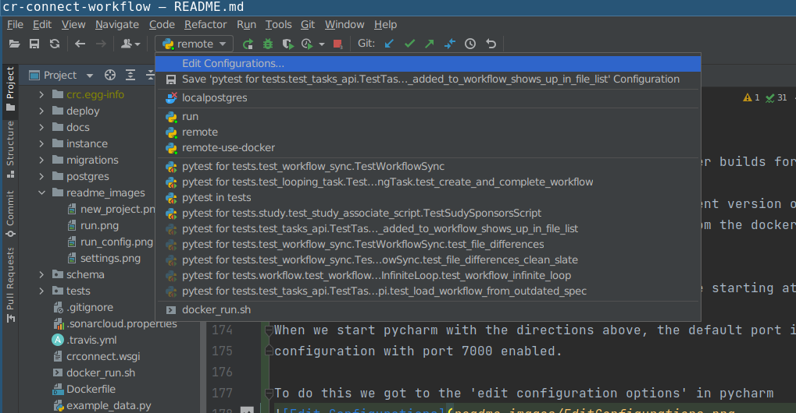
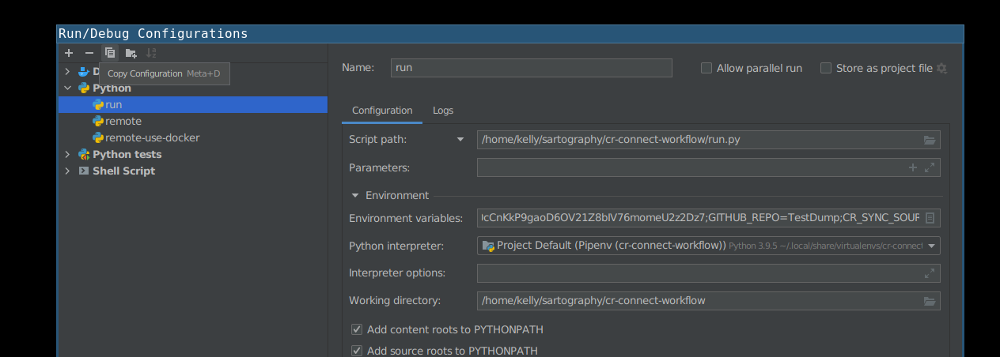

# sartography/cr-connect-workflow

[](https://travis-ci.com/sartography/cr-connect-workflow)

# CR Connect Workflow Microservice
## Development Setup
### Tools
These instructions assume you're using these development and tools:
- IDE: PyCharm Professional Edition
- Operating System: Ubuntu

### Environment Setup
Make sure all of the following are properly installed on your system:
1. `python3` & `pip3`:
    - [Install python3 & pip3 on Linux](https://www.digitalocean.com/community/tutorials/how-to-install-python-3-and-set-up-a-programming-environment-on-an-ubuntu-18-04-server)
    - [Installing Python 3 on Linux](https://docs.python-guide.org/starting/install3/linux/)
    - For windows, install Python 3.8 from Mircosoft Store, which comes with pip3
2. `pipenv`:
    - From a terminal or Powershell, 'pip install pipenv'
    - For windows, make note of the location where the pipenv.exe is placed, it will tell you in the output.  For me
      it was C:\Users\danie\AppData\Local\Packages\PythonSoftwareFoundation.Python.3.8_qbz5n2kfra8p0\LocalCache\local-packages\Python38\Scripts\pipenv.exe
    - [Install pipenv](https://pipenv-es.readthedocs.io/es/stable/)
    - [For Linux: Add ${HOME}/.local/bin to your PATH](https://github.com/pypa/pipenv/issues/2122#issue-319600584)
     
3. `install depdencies`
    - pipenv install 
    - pipenv install --dev    (for development dependencies)

### Running Postgres
We use a docker container to run postgres, making it easier to get running
locally (at least for linux) Docker containers on windows are alitt
trickly, so see detailed directions below ...

#### Linux 
1. There is a sub-directory called "postgres" that contains a docker-compose script.

#### Windows
You will need to install Docker (and Docker Compose which comes with this) installed. See:
https://docs.docker.com/compose/install/  I had good success using Docker Desktop to 
fire up the docker container.

Once you have Docker installed for windows, you will need to enable resource file sharing
(go the Docker / Settings / Resources / Filesharing and enable File shareing for the full C:/ 
drive.  

Due to some permission issues with Docker, you need to create a shared docker volume.
On the command line, cd into your postges directory, and run the following:
```
docker volume create --name=data
```

Finally, you can use docker compose to build the docker instance
```
docker-compose -f docker-windows-compose.yml up --no-start
```
Assuming you have docker and docker-compose installed correctly, and you fixed the permission
issues as described above, these should execute without error.
At which point you can open up the Docker Desktop Dashboard and see postgres now exists
as a docker container.  Hit play, and it should show that it is running.  Congratulations!
Postgres is running.  

When you come back to this later, you may need to start the docker container again, but
it should always be visible in the Docker Desktop Daskboard with a friendly little play
stop button for your clicking pleasure.


### Environment Setup Part #2
If you want to run CR-Connect in development mode you must have the following two services running:
1. `Postgres Docker`:  There is a sub-directory called Postgres that contains a docker image that will set up an empty
database for CR-Connect, and for Protocol Builder Mock, mentioned below.  For must systems, you can 'cd' into this
directory and just run start.sh to fire up the Postgres service, and stop.sh to shut it back down again.
create .env file in /postgres with the following two lines in it:
```
DB_USER=crc_user
DB_PASS=crc_pass
```
With this in place, from the command line:
```bash
cd postgres
./start.sh
```
You can now build the database structure in the newly created database with the following lines
```baseh
cd ..  (into base directory)
flask db upgrade
flask load-example-data (this creates some basic workflows for you to use)
```

2. `Protocol Builder Mock`: We created a mock of the Protocol Builder, a critical service at UVA that is a deep
dependency for CR-Connect.  You can find the details here: [Protocol Builder Mock](https://github.com/sartography/protocol-builder-mock)
Be sure this is up and running on Port 5002 or you will encounter errors when the system starts up.

With Protocol Builder Mock up and running, visit http://localhost:5001 and create a study.  Set the user
and primary investigator to dhf8r - which is a user in the mock ldap service, and this will later show up when you
fire up the interface.

### Configuration
1. `instance/config.py`: This will configure the application for your local instance, overriding the configuration
in config/default
 

### Project Initialization
1. Clone this repository.
2. In PyCharm:
    - Go to `File > New Project...`
    - Click `Pure Python` (NOT `Flask`!!)
    - Click the folder icon in the `Location` field.
    - Select the directory where you cloned this repository and click `Ok`.
    - Expand the `Project Interpreter` section.
    - Select the `New environment using` radio button and choose `Pipenv` in the dropdown.
    - Under `Base interpreter`, select `Python 3.7`
    - In the `Pipenv executable` field, enter `/home/your_username_goes_here/.local/bin/pipenv` 
    - Click `Create`
        
3. PyCharm should automatically install the necessary packages via `pipenv`. 
For me, the project interpreter did not set set up for me correctly on first attempt.  I had to go
to File -> Settings -> Project Interpreter and again set the project to use the correct PipEnv 
environment. Be sure that your settings like simliar to this, or attempt to add the interpreter again
by clicking on the gear icon.
 

4. With this properly setup for the project, you can now right click on the run.py and set up a new 
run configuration and set up a run configuration that looks like the following (be sure to save this 
run configuration so it doesn't go away.) :


### Running the Web API
Just click the "Play" button next to RUN in the top right corner of the screen.
The Swagger based view of the API will be avialable at http://0.0.0.0:5000/v1.0/ui/

### Running Tests
We use pytest to execute tests.  You can run this from the command line with:
```
pipenv run coverage run -m pytest
```
To run the tests within PyCharm set up a run configuration using pytest (Go to Run, configurations, click the
plus icon, select Python Tests, and under this select pytest, defaults should work good-a-plenty with no
additional edits required.) 


## Documentation
Additional Documentation is available on [ReadTheDocs](https://cr-connect-workflow.readthedocs.io/en/latest/#)

## Setting up multiple environments to test Sync
In some cases (for example when testing syncing) - you might want to run multiple copies of the API at the same time.
Luckily, PyCharm lets us do this fairly easily 

In most cases, you can use the sartography-utils repository to generate a docker file for all of the required 
infrastructure such as the Database, PB, frontend, etc. 

I create two different files from the 'generator' there and then use different port bases such as the typical 5000 
and an alternate 7000 - 

See [here](https://github.com/sartography/sartography-utils/blob/main/stackdeploy-generator/README.md) for the 
README on how to do this, but the cliffs notes is 

```
 sudo ./stackdeploy-generator.py -F ./cr_connect/ -c ./docker-compose-c_stack.yml --port-range 9000 -i c_stack
```

Once this is done, you can start up the entire stack by doing a 

```angular2html
docker-compose -f doocker-compose-c_stack.yml up
```
and it will start an entire stack with the latest docker builds for each component.

When testing, however we will want to run our development version of the backend (for example)
and we will want to comment out the backend service from the docker-compose file as well as any dependencies found 
so that we run everything EXCEPT the backend service

We will want to have two such docker-compose files, one starting at port 5000 and one at 7000.

When we start pycharm with the directions above, the default port is :5000 - so we will need to create a second 
configuration with port 7000 enabled.

To do this we got to the 'edit configuration options' in pycharm

Copy the default 'run' configuration

and then edit the environment variables (click on the little page icon to make it easier to edit)
you will need to add the following :
- SERVER_NAME=localhost:7000
- CORS_ALLOW_ORIGINS=localhost:7000,backend:7000,localhost:7002,bpmn:7002,localhost:4200,frontend:4200

and if you want to set up development on a remote box you will want to also define
- APPLICATION_ROOT=http://192.168.0.60:5000/v1.0

and you would replace the ip address with your actual IP address or url that you have set up. This is useful if you 
have a remote development box or a cloud instance that you are developing on.
Pycharm has some really great remote development tools where you can set up a SSH remote endpoint and it will copy 
over your files as you work and it feels very much like working locally (complete with debug access)
[Documentation here](https://www.jetbrains.com/help/pycharm/configuring-remote-interpreters-via-ssh.html#ssh)

### Setting up Remote channels 
At the time of writing this, there are a number of options available for setting up new sync servers and GitHub 
repositories to sync to - here are some of the main ones

- **GITHUB_TOKEN**	*example* =ghp_q0coD6OV21Z8bIV76momeU2z2Dz7
  <br/> this is the personal github token that you set up as a developer on the sync repository
- **GITHUB_REPO**	*example*=TestDump <br/> This is the repository that you want to sync to
- **TARGET_BRANCH**	*example*=remotebox<br/> This is the branch to sync to - if it is not already out there, it will 
  be created the first time you sync
- **CR_SYNC_SOURCE__x__url**	*example*=http://localhost:5000/v1.0 <br/> This is the sync source - newer files will 
  be pulled from this source - x is a number from 0 to however many sources you want to show in the BPMN server
- **CR_SYNC_SOURCE__x__name** *example*=	MainBox <br> a name for the source x starts at 0 and corresponds with 
  the link


### Not using Pycharm?
Setting up multiple environments to work in is still possible even when not using pycharm, you would need to set up 
a script for each development environment. You need and define all of the proper environment variables first, we just 
like the pycharm setup because it allows us lots of debugging flexibility across all of these running instances. 

## Manual Synch
You can move all the BPMN diagrams from one system to another (upgrading and replacing as needed)  This is how
we will transfer files from staging to production. 
Eventually we will connect this into the front end code for the BPMN Editor, but for now, you can do so by:

1. Run flask clear-db to clear out your local database if desried (this isn't reuired, but will give you a clean slate 
to get an exact replica of production/testing whatever)

2. Log into the Swagger UI for the system you want to move all files to (this could be a local development machine)

3. Set the API Token under authentication.  This token must match what is on the testing server.  This might
match what is in the default config, at least, that will work for staging.

4. Run the workflow_synch/pullall in swagger, using the url for the site you want to pull from:
   something like "https://testing.crconnect.uvadcos.io/api"

5. Be patient.  It may take a minute or more to pull everything down.


### Additional Reading

1. [BPMN](https://www.process.st/bpmn-tutorial/)  Is the tool we are using to create diagrams
of our business processes.  It's is a beautiful concise diagramming tool. We strongly recommend you 
read this complete tutorial, as this notation is the foundation on which this project as well as many
other software systems for businesses are built.  Know it well.

### Notes on Creating Good BPMN Diagrams in Comunda
1. Be sure to give each task a thoughtful (but unique!) id. This will 
make the command line and debugging far far easier.  I've tended to pre-fix
these, so task_ask_riddle if a task is asking a riddle for instance.
