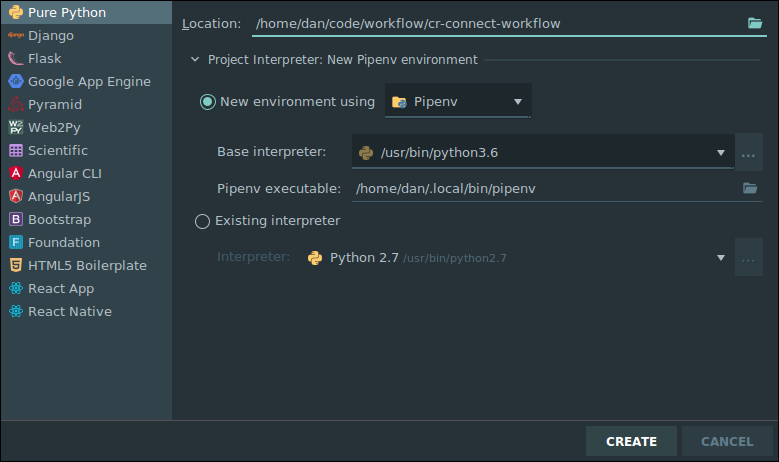
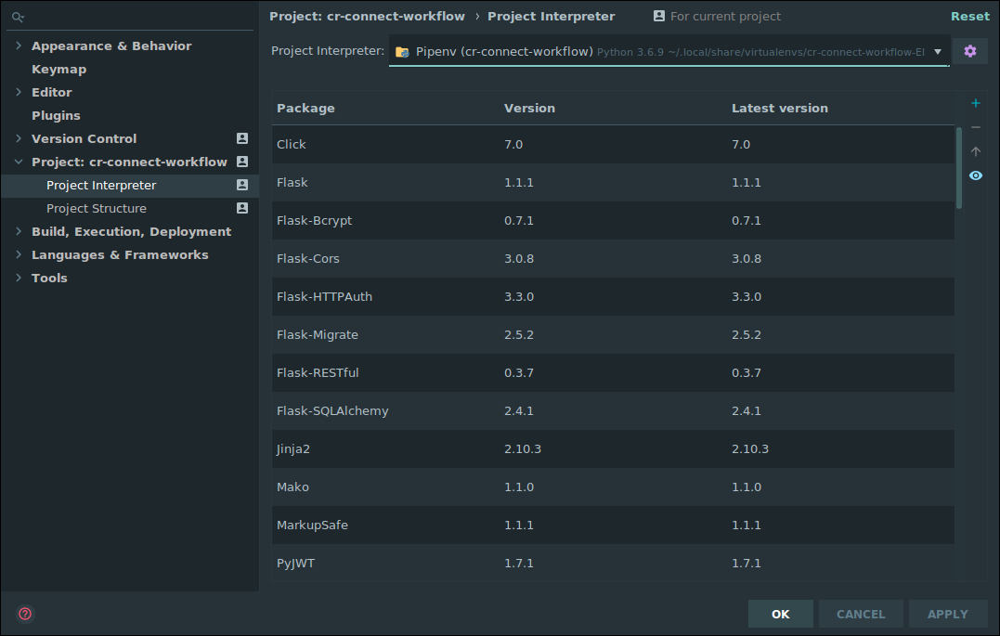
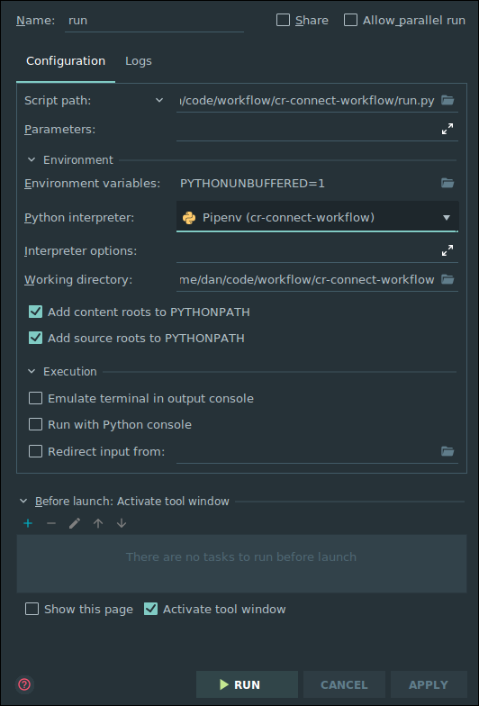

# CR Connect Workflow Microservice
## Development Setup
### Tools
These instructions assume you're using these development and tools:
- IDE: PyCharm Professional Edition
- Operating System: Ubuntu

### Environment Setup
Make sure all of the following are properly installed on your system:
1. `python3` & `pip3`:
    - [Install python3 & pip3](https://www.digitalocean.com/community/tutorials/how-to-install-python-3-and-set-up-a-programming-environment-on-an-ubuntu-18-04-server)
    - [Installing Python 3 on Linux](https://docs.python-guide.org/starting/install3/linux/)
2. `pipenv`:
    - [Install pipenv](https://pipenv-es.readthedocs.io/es/stable/)
    - [Add ${HOME}/.local/bin to your PATH](https://github.com/pypa/pipenv/issues/2122#issue-319600584)

### Project Initialization
1. Clone this repository.
2. In PyCharm:
    - Go to `File > New Project...`
    - Click `Pure Python` (NOT `Flask`!!)
    - Click the folder icon in the `Location` field.
    - Select the directory where you cloned this repository and click `Ok`.
    - Expand the `Project Interpreter` section.
    - Select the `New environment using` radio button and choose `Pipenv` in the dropdown.
    - Under `Base interpreter`, select `Python 3.6`
    - In the `Pipenv executable` field, enter `/home/your_username_goes_here/.local/bin/pipenv` 
    - Click `Create`
        
3. PyCharm should automatically install the necessary packages via `pipenv`. 
For me, the project interpreter did not set set up for me correctly on first attempt.  I had to go
to File -> Settings -> Project Interpreter and again set the project to use the correct PipEnv 
environment. Be sure that your settings like simliar to this, or attempt to add the interpreter again
by clicking on the gear icon.
 

4. With this properly setup for the project, you can now right click on the run.py and set up a new 
run configuration and set up a run configuration that looks like the following (be sure to save this 
run configuration so it doesn't go away.) :

### Running the project
Just click the "Play" button next to RUN in the top right corner of the screen.
The Swagger based view of the API will be avialable at http://0.0.0.0:5000/v1.0/ui/
